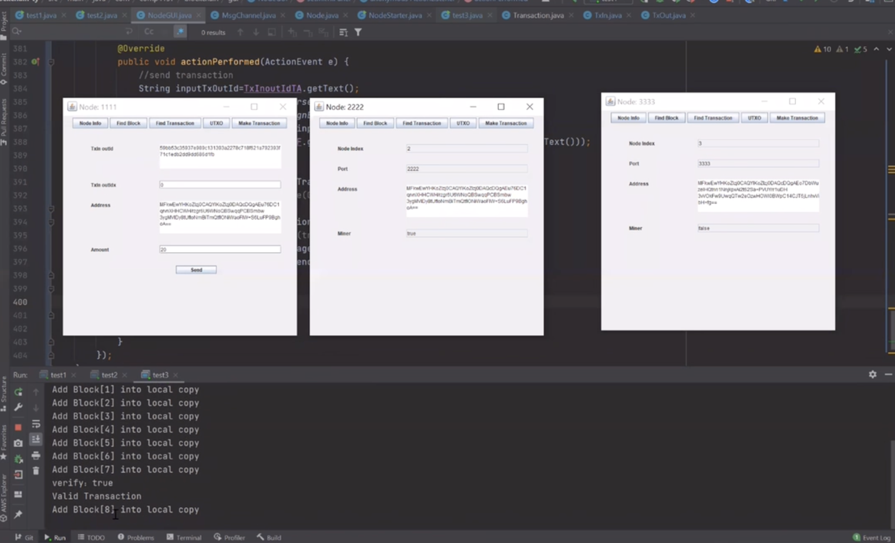
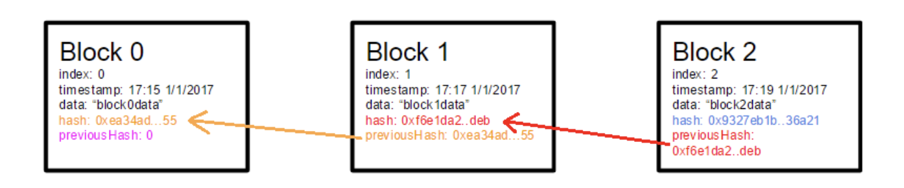
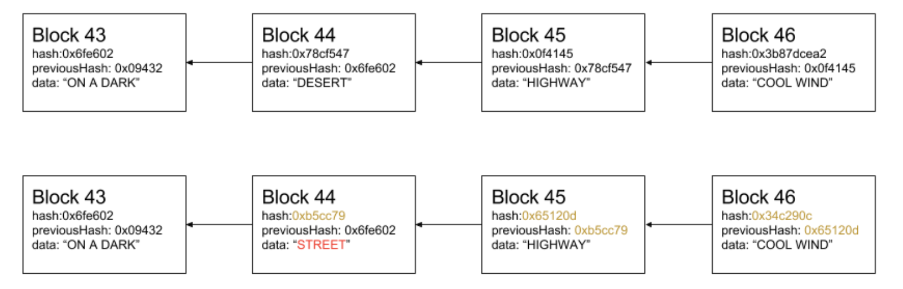
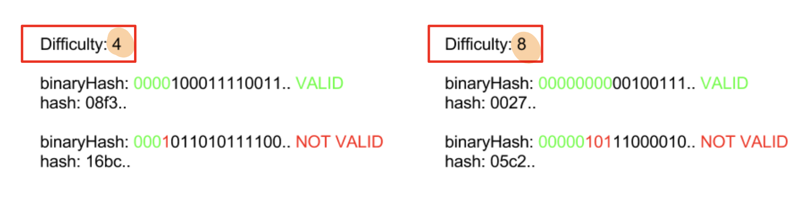
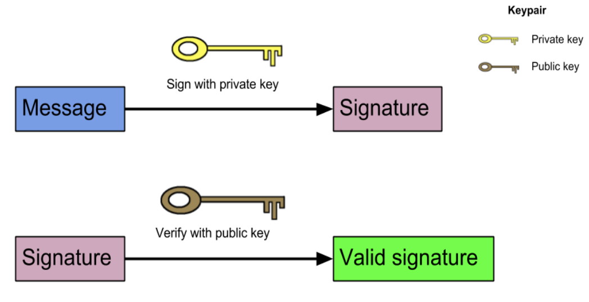
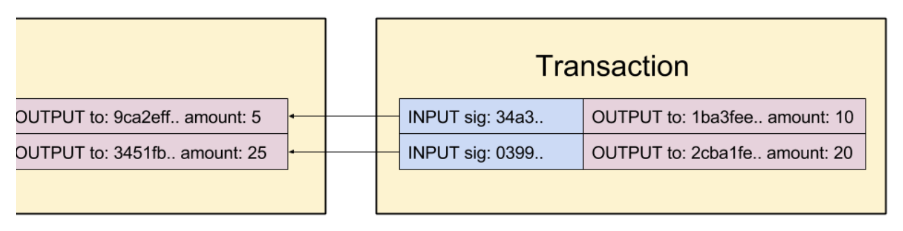

# A Java-based Blockchain with GUI
A Java-based PoW blockchain as well as a basic GUI to demonstrate some functions of the blockchain including making transactions, searching block information, and searching transaction information. Also, the project has implemented Apache Maven to help us manage and download the project’s required library and dependencies.
- :star2: **Found this repository helpful?** Light it up with a star and make my day! :wink:

## Outline
0. Setup
1. Network
2. Blockchain Prototype 
3. Mining
4. Transaction
5. Mint Coins

### 0.Setup
1. Clone the repo
```shell
git clone https://github.com/WANG-Tingyu/Blockchain-ty.git
```
2. Make sure your configure correct maven repo. Check dependencies. 
3. Go to 
```shell
src/test/java/test1.java
src/test/java/test2.java
src/test/java/test3.java
```
4. Run them. NodeStarter will start. The network is established. You can customize network setting including **adding more nodes**, deciding which node is **minor**, **allocating ports** for each node, etc.
```shell
Port 1111 for Node 0. Node 0 is miner.
Port 2222 for Node 1. Node 1 is miner.
Port 3333 for Node 2.
```
```shell
public static void main(String[] args) throws Exception {
        new NodeStarter("0", "1111", "yes").startApp();
}
```
5. Demo

<video src="images/demo.mp4" controls="controls" width="500" height="300" poster="images/f6.png"></video>


### 1. NETWORK
- Blockchain network is a P2P (Peer-to-Peer) network 
- Nodes are connected directly to each other
- An essential part of a node is to share and sync the blockchain data with other nodes.
- The following rules are used to keep the network in sync.
  1. inv: When a node generates a new block, it **broadcasts** the block to the network
  2. getblock: When a node connects to a new peer, it queries for the latest block


- We simplify the network implementation in our project. 
- Run multiple blockchain nodes on a **single machine** 
  - They have different addresses.
- Use **ports** as node identifiers, instead of IP addresses.
  - E.g., there will be nodes with addresses: 127.0.0.1:3000, 127.0.0.1:3001, 127.0.0.1:3002, etc.


- Determine the node is a mining node or not
- Broadcasting
  - Type 1: Request for blocks
  - Type 2: Newly minted block
  - Type 3: Transactions

### 2. Blockchain Prototype
- The blockchain system stores valuable information in blocks. 
  - For example, Bitcoin stores transactions in its blocks.
- A block contains some technical information 
  1. Height of the current block
  2. Block creation timestamp
  3. Hash of the previous block
  4. Hash of the current block


#### 2.1 Block Structure
1. Index: Block height
2. Timestamp: UnixTimeEpoch()
3. Data: Any data that is included in the block
4. Hash: A SHA-256 hash value taken from the content of current block
5. PrevBlockHash: A SHA-256 hash value taken from the content of previous block

```java
class Block {
  public index: number;
  public timestamp: number;
  public hash: string;
  public previousHash: string;
  public data: string;
}
```


#### 2.2 Block Hash
- The block hash is calculated over all data of the block 
  - including the index, timestamp, previousHash, and data

```java
hash = (index: number, timestamp: number, previousHash: string, data: string): string =>
CryptoJS.SHA256(index + previousHash + timestamp + data).toString();
```


#### 2.3 Generating a Block
- To generate a block, we must know the hash of the previous block and create the rest of the required content (= index, timestamp, hash, and data).
- Block data is provided by the end-user but the rest of the parameters are generated:
```java
generateNextBlock = (blockData: string) => {
    previousBlock: Block = getLatestBlock();
    nextIndex: number = previousBlock.index + 1;
    nextTimestamp: number = new Date().getTime() / 1000;
    nextHash: string = calculateHash(nextIndex, previousBlock.hash, nextTimestamp, blockData);
    newBlock: Block = new Block(nextIndex, nextHash, previousBlock.hash, nextTimestamp, blockData);
    return newBlock;
};
```

#### 2.4 Block Integrity Validation
- For a block to be valid, the following must apply:
  1. The index of the block must be one number **larger** than the previous one 
  2. The **previousHash** of the block matches the hash of the previous block
  3. The hash of the block itself must be **valid**
```java
isValidNewBlock = (newBlock: Block, previousBlock: Block) => {
    if (previousBlock.index + 1 !== newBlock.index) 
        return false; 
    else if (previousBlock.hash !== newBlock.previousHash) 
        return false; 
    else if (hash(newBlock) !== newBlock.hash) 
        return false; 
    else return true;
};
```

### 3. Mining
- Blockchain is a public database and everyone could write data into it.
- To avoid conflict, we need to **set some challenges** for adding a new block.
- A **Proof-of-Work (PoW)** algorithm is required to be realized in this project.
- We implement a simple PoW scheme, which can generate a block every **30 seconds**.

#### 3.1  Difficulty and Nonce
- Two new properties should be added to the block structure: **difficulty and nonce**.
```java
class Block {
    public index: number;
    public hash: string;
    public previousHash: string;
    public timestamp: number;
    public data: string;
    public difficulty: number;
    public nonce: number;
}
```
- The **difficulty** defines **how many prefixing zeros** the block hash must have, for the block to be valid.
  
- Check whether the hash is correct in terms of difficulty:
```java
hashMatchesDifficulty = (hash: string, difficulty: number): boolean => { 
    hashInBinary: string = hexToBinary(hash);
    requiredPrefix: string = '0'.repeat(difficulty);
    return hashInBinary.startsWith(requiredPrefix);
};
```

#### 3.2 Proof-of-Work Puzzle
- To find a valid block hash, we must **increase the nonce** until we get a **valid hash**. 
- To find a qualified hash is completely a random process.
  - We must loop through enough nonces until we find a qualified hash
```java
findBlock = (index: number, previousHash: string, timestamp: number, data: string, difficulty: number): Block => {
    let nonce = 0;
    while (true) {
        const hash: string = calculateHash(index, previousHash, timestamp, data, difficulty, nonce);
        if (hashMatchesDifficulty(hash, difficulty)) {
            return new Block(index, hash, previousHash, timestamp, data, difficulty, nonce); 
        }
        nonce++; 
    }
};
```

#### 3.3 Consensus on the Difficulty
- How to determine the difficulty for all nodes?
- Two new constants are introduced:
  1. BLOCK_GENERATION_INTERVAL: defines how often a block should be found.
  2. DIFFICULTY_ADJUSTMENT_INTERVAL: defines how often the difficulty should be adjusted with the increasing or decreasing network hashrate.
- For every 10 blocks that are generated, we check if the time that took to generate those blocks are larger or smaller than the expected time.
  - The **expected time** is calculated like this: 
  - **BLOCK_GENERATION_INTERVAL * DIFFICULTY_ADJUSTMENT_INTERVAL**
- We either increase or decrease the difficulty **by one** if the time taken is at least **two times** greater or smaller than the expected difficulty.

```java
getDifficulty = (aBlockchain: Block[]): number => {
    latestBlock: Block = aBlockchain[blockchain.length - 1];
    if (latestBlock.index % DIFFICULTY_ADJUSTMENT_INTERVAL == 0 && latestBlock.index !== 0) {
        return getAdjustedDifficulty(latestBlock, aBlockchain); 
    } else {
        return latestBlock.difficulty;
    }
};
```
```java
getAdjustedDifficulty = (latestBlock: Block, aBlockchain: Block[]) => {
prevAdjustmentBlock: Block = aBlockchain[blockchain.length - DIFFICULTY_ADJUSTMENT_INTERVAL]; timeExpected: number = BLOCK_GENERATION_INTERVAL * DIFFICULTY_ADJUSTMENT_INTERVAL; timeTaken: number = latestBlock.timestamp - prevAdjustmentBlock.timestamp;
if (timeTaken < timeExpected / 2) {
        return prevAdjustmentBlock.difficulty + 1;
    } else if (timeTaken > timeExpected * 2) {
        return prevAdjustmentBlock.difficulty - 1;
    } else {
        return prevAdjustmentBlock.difficulty;
    }
};
```

### 4. Transaction (Tx)
- With the implementation of Tx, we shift our system from a “general purpose” blockchain to a cryptocurrency.
- We can send coins to some addresses if we can show a proof that we own them in the first place.
- To enable this, we describe some new concepts 
  1. Public-key cryptography
  2. Signatures
  3. Transaction inputs and outputs

#### 4.1 Public-key Cryptography and Signatures
- In Public-key cryptography, we have a keypair: a private key and a public key.  Any messages can be signed using the private key to create a signature.
  - With the signature and the corresponding public key, anyone can verify that the signature produced by the private key can match the corresponding public key.
- We can use a library (i.e., elliptic) for the public-key cryptography, which uses elliptic curves. (= ECDSA)



#### 4.2 Transaction Structure
- Transaction consists of two components: inputs and outputs.
- Outputs specify **where the coins are sent**, and inputs give a proof that the coins are
existing in the first place and are owned by the “sender”. 
- Inputs always refer to **an existing (unspent) output**.
```java
class Transaction {
    public id: string;
    public txIns: TxIn[];
    public txOuts: TxOut[];
}
```


#### 4.3 Transaction Outputs
- Transaction output (txOut) consists of an address and the amount of coins. 
- The address is an ECDSA public-key.
  - The user having the private-key of the referenced public-key (=address) will be able to access the coins.
```java
class TxOut {
    public address: string;
    public amount: number;
    constructor(address: string, amount: number) {
        this.address = address;
        this.amount = amount;
    } 
}
```
#### 4.4 Transaction Inputs
- Transaction input (txIn) provides the information **“where” the coins are coming from**.
- Each txIn refers to an earlier output, from which the coins are ‘unlocked’, with the signature.
  - These unlocked coins are now ‘available’ for the txOut.
  - The signature gives a proof that only the user, who has the private-key of the referred public-key (=address), could create the transaction.

```java
class TxIn {
    public txOutId: string;
    public txOutIndex: number;
    public signature: string;
}
```
#### 4.5 Transaction ID
- Transaction ID (txId) is calculated by taking a **hash from the content of the transaction**.

```java
const getTransactionId = (transaction: Transaction): string => {
    const txInContent: string = transaction.txIns
        .map((txIn: TxIn) => txIn.txOutId + txIn.txOutIndex)
        .reduce((a, b) => a + b, '');
    const txOutContent: string = transaction.txOuts
        .map((txOut: TxOut) => txOut.address + txOut.amount)
        .reduce((a, b) => a + b, '');
    return CryptoJS.SHA256(txInContent + txOutContent).toString();
};
```

### 5. Mint Coins
- Transaction inputs must always refer to unspent transaction outputs, but where are the initial coins from in the blockchain?
- To solve this, a special type of transaction is introduced 
  - **coinbase transaction**
- The coinbase transaction contains only an output, but no input. 
  - A coinbase transaction adds new coins to circulation.
  - We specify the amount of the coinbase output to be **50 coins**.
```java
const COINBASE_AMOUNT: number = 50;
```

#### 5.1 Coinbase Transaction
- The coinbase transaction is always the first transaction in the block, which is included by the miner of the block.
- The coinbase **reward** acts as an incentive for the miners 
  - If you find the block, you are able to collect 50 coins.
- We add the **block height** to the input of coinbase transaction.
  - This is to ensure that each coinbase transaction has a **unique txId**.
  - Without this rule, for instance, a coinbase transaction stating “give 50 coins to address 0xabc” would always have the same txId.


### TRANSACTION
- Normal Transaction 
  - TxIn
    - TxOut id, index & signature 
  - TxOut
    - Public key & amount
- UTXO
  - Hashmap
    - Key: Transaction id
    - Value: TxOut
- Coinbase Transaction
  - Empty TxIn
  - Reward for miner: 50


### MINING 
- Nonce
  - Increment for every iteration
- Dynamic Difficulty Adjustment
  - Review difficulty every 4 blocks
  - Time Expected: 4 blocks * 25 seconds = 100 seconds
  - Time taken < Time Expected / 2
    - Difficulty + 1
  - Time taken > Time Expected * 2
    - Difficulty - 1


## Design and Implementation
### Transaction
- Within each transaction, there exists an id, input and output. In each input, it should include the old transaction output id, index, and a signature to sign the transaction to make the transaction valid. In each output, it includes the receiver address which is also the public key, and the amount transferred to the recipient. For the id in the transaction, it is generated by the hash value of the transaction input and output data. The data is the sum of every transaction input’s address and amount, and the sum of every transaction output’s address and amount. For transaction id, it is constructed by the transaction input and output content. The transaction input content is the concatenated string of every transaction input’s transaction output id and index. The transaction output content is the concatenated string of every transaction output’s address and amount. The final transaction id would be the hashed value of the transaction content.
To create a new normal transaction, the transaction input and transaction output data are required to construct the transaction. When a transaction is created, a message with the transaction and the message type would be broadcasted to the network. After broadcasting the message, the validated transaction would be added to the synchronized transaction pool for the miner to include them in the newly mined block, hence, confirming the transaction.

- To validate the new transaction before adding the transaction into the transaction pool, the node has to validate the signature inside the transaction and the transaction inputs are the unspent transaction outputs that are inside the UTXO hashmap. For every transaction input, if the concatenated string of the transaction output id and transaction output index is not found in the UTXO hashmap, the transaction would be invalid. If the record is found in the UTXO hashmap, the total input amount would be retrieved and calculated. Also, the total output amount in the transaction would be calculated by the transaction outputs’ amount. If the total input amount and the total output amount is not match, the transaction is invalid. For the transaction signature, it is validated for every transaction input. The signature of the transaction input and the transaction output id would be passed to the ECDSA verifier together with the public key of the node. If every transaction inputs have a correct signature and the transaction inputs are inside the UTXO hashmap, the transaction is valid.
- After the validation is completed for the transaction, it would be added to the synchronized transaction pool to wait for confirmation when the transaction is included in a newly mined block.
- Besides normal transactions, coinbase transaction is another type of transaction that refer to the initial coin of the blockchain which is the first transaction in a new block, and it is used as the reward for the miner when they successfully mined a block. In a coinbase transaction, it includes only the transaction output but not the transaction input as it is not referring to any unspent transaction outputs. It is generated only by block mining. In the project implementation, we have set the coinbase transaction reward as 50. Whenever a block is mined, the transaction output inside the coinbase transaction is constructed by the public key of the node which is the node address, and the reward amount of mining which is 50 in our project.
- The validation on coinbase transactions is a bit different from the normal transaction. As the coinbase transaction does not include any transaction input. So, it is not needed for the coinbase transaction to include an unspent transaction in transaction.

### UTXO
- UTXO is an essential element in this blockchain system as it controls all the transactions and makes sure no double-spending problem occurs in the blockchain network. To achieve this, a key-value pair hashmap is used in every node to store the unspent transactions. The key is the transaction id and the value is the transaction output.
- The UTXO hashmap would be updated when the transaction is added to a block. In other words, it would be updated when a new block is mined because the mined block would include the transactions in the transaction pool which is still pending confirmation. After the new block is mined or the node receives the block from other nodes, the validation process on block information and transactions would happen. After successful validation, the UTXO list in the node would be updated. To update the UTXO, the block must first include the transaction list. Then, for every transaction input in the transaction, the UTXO would remove the record that the key is equal to the transaction input’s transaction out id and index. For every transaction output in the transaction, put the transaction output into the UTXO list with the key is the transaction id plus the current iteration number on the transaction outputs. Do the process for every transaction in the block, then the UTXO hashmap would be updated after the new block is added to the blockchain.

### Network
- In this project’s implementation, we have simulated different nodes in the same network by separating them into different ports. Every port represents an actual node in the blockchain network. To achieve this, each node would include a port number and the list of other ports which used to run other nodes. Also, we include another boolean attribute to determine if the node is a miner or not. It is used to classify the node’s responsibility in the network. If the node is a miner, it could work on the mining process, and confirm the batch of transactions.
- In the peer-to-peer network, the node has to get blocks from the neighbour node when it is initialized. A new message with the local chain size and the message type would be sent to the other nodes. When the existing nodes received the request message, the node would loop through the local chain and broadcast the block within each iteration.
- Besides sending blocks by request, the new block needs to be broadcasted to different nodes to make the block valid. When a new block is mined, a new message would be created which includes the new block and the type of the message. Then, the message would be broadcasted to every node in the port list through the message channel using a socket.
- When a message of block is received, the block needs to be validated before adding it to the local chain. The new block index must be equal to the latest block index plus 1. The previous hash value in the new block must be equal to the hash value of the latest block. The hash included in the block must be equal to the hash calculated using the block’s content. Also, the transactions inside the block must not be spent before. If the received block is the first block in the local chain which is a genius block, the validation would be on the new block’s hash and the transactions inside the new block only. After the validation, the block would be added to the local chain.
- Moreover, the transactions would be synchronized between the nodes in the network. When a non-coinbase transaction is created, the transaction would be validated. If the transaction is valid, it would be added to the synchronized transaction pool for miners to include them in the newly mined block.

### Mining
- To start mining, the node would first need to find the new block, and then add transactions into the block to confirm those pending transactions.
- For the process of finding a new block, the system would first need to make sure there are transactions in the transaction pool for the new block to include those unconfirmed transactions. After that, the node will run a “findBlock'' function. In the function, the nonce that is initially zero, would be added to the block’s string which includes the index, timestamp, previous block’s hash, root hash of the transactions and the difficulty of mining this block. The actual computation process of mining would happen, the function would see if the hashed value of the concatenation of the nonce and the block’s string started with the required difficulty level which is the number of prefix 0 in the hash. If it fails, the nonce would be incremented by 1, and the process would run again until the required number of prefix zero is fulfilled in the hash value satisfied. After finding such nonce and hash value, a new block would be created by the calculated nonce, the generated hash value, the index of the new block, timestamp, previous block’s hash, root hash of the transactions and the difficulty of mining this block.
- After the block has been found, the transaction in the pending transaction pool would be added to the block. The transaction on the transaction pool would be added to the block one by one. If the transaction in the transaction pool is valid, the block would be added to the local blockchain. Also, the unspent transaction would be removed from the UTXO hashmap, and the transaction outputs in the transaction would be put back into the UTXO hashmap.
- The final step after mining would be broadcasting the block into the network. After the block is broadcasted to the entire network and is accepted by more than 51% of the node, the transactions inside this block could be formally confirmed as valid transactions.
- he miner can get rewards after the block is mined and successfully added to the main chain from the coinbase transaction.

### Difficulty of Mining
- In this project, the mining difficulty is controlled by the block generation interval and the difficulty adjustment interval. The default block generation interval is set to 4, and the difficulty adjustment interval is set to 25 seconds.
- For every 4 blocks mined, the difficulty of mining would be reviewed, and maybe recalculated. To determine if the mining difficulty needs to be adjusted, the time expected to generate a block and the actual time taken to generate a block would be taken into consideration. The time expected is calculated by multiplying the block generation interval and the difficulty adjustment interval. The actual time taken is the difference between the latest block and the previous adjustment block which is 4 blocks before.
- If the time taken is smaller than half of the time expected to generate a block, the difficulty would be added by 1 from the previous adjustment block which is one more prefix zero required for mining. However, the difficulty would be reduced by 1 when the time taken is larger than twice the time expected. If none of the mentioned scenarios happened, the difficulty would remain unchanged.
- This could ensure the difficulty of the blockchain could be adjusted dynamically based on the block generation speed.

---
- :star2: **Found this repository helpful?** Light it up with a star and make my day! :wink:
